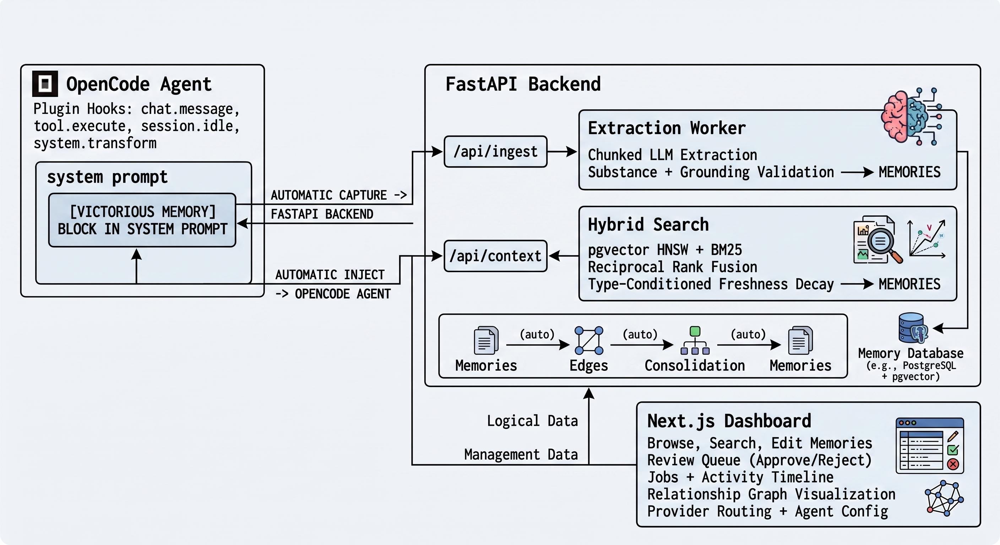

# Victorious Memory

**A memory system for AI coding agents that actually remembers — without being asked.**



Most AI agent memory systems fail the same way: the agent gets busy, forgets to check memory before acting, forgets to write things down after, and everything useful stays hidden in a database you can't see or edit. Victorious Memory fixes all of that.

- **No "remember this" needed.** The plugin captures every conversation automatically, extracts durable knowledge through LLM pipelines, and injects relevant context back into future sessions — all before the agent starts working.
- **You can still do it manually.** 11 MCP tools let the agent (or you) search, save, approve, reject, trigger extraction, run edge detection, and consolidate — full control when you want it.
- **It's not a black box.** A full web dashboard lets you browse, search, edit, organize, and tune your memory system. See exactly what the agent sees, what got extracted, what's pending review, and what the relationship graph looks like.
- **It never breaks your workflow.** Circuit breaker, hard timeouts, offline queue — if the backend dies, OpenCode keeps running like nothing happened. Memory resumes automatically when the server comes back.

## How it works

```
                ┌──────────────────────────────────────────────────┐
                │                  OpenCode Agent                   │
                │                                                  │
   capture ◀─── │  plugin hooks: chat.message, tool.execute,      │
   (automatic)  │  session.idle, system.transform                  │
                │                                                  │
   inject ───▶  │  [VICTORIOUS MEMORY] block in system prompt      │
   (automatic)  └───────────────┬──────────────────────────────────┘
                                │
                                ▼
        ┌───────────────────────────────────────────────┐
        │              FastAPI Backend (:8080)            │
        │                                               │
        │  /api/ingest ─▶ extraction worker              │
        │       │  chunked LLM extraction (6K tokens)    │
        │       │  substance + grounding validation      │
        │       ▼                                       │
        │  /api/context ◀─ hybrid search                │
        │       │  pgvector HNSW + BM25                  │
        │       │  Reciprocal Rank Fusion (k=60)        │
        │       │  type-conditioned freshness decay     │
        │       ▼                                       │
        │  memories ◀── edges ◀── consolidation          │
        │               (auto)      (auto)               │
        └───────────────┬───────────────────────────────┘
                        │
                        ▼
        ┌───────────────────────────────────────┐
        │         Next.js Dashboard (:3002)      │
        │                                       │
        │  Browse, search, edit memories         │
        │  Review queue (approve/reject)        │
        │  Jobs + activity timeline              │
        │  Relationship graph visualization     │
        │  Provider routing + agent config      │
        └───────────────────────────────────────┘
```

## Why not just use RAG?

| Problem with typical memory systems | How Victorious Memory solves it |
|---|---|
| Agent forgets to query memory before acting | Context is **injected automatically** into every system prompt — no tool call needed |
| Agent never writes things down | Conversations are **captured and extracted automatically** — no "remember this" needed |
| Retrieved memories are stale or irrelevant | **RRF fusion + freshness decay** — type-conditioned (decisions don't expire, dailies do) |
| Memory is a black box you can't inspect | **Full web dashboard** — browse, search, edit, approve, graph, tune everything |
| System goes down → agent stops working | **Circuit breaker + offline queue** — OpenCode runs uninterrupted, memory resumes on recovery |
| Duplicate/contradictory memories pile up | **Consolidation pipeline** — near-dup merge, staleness sweep, usage demotion (supersede, never delete) |
| Memories are isolated islands | **Edge detection pipeline** — discovers relationships (causes, enables, contradicts, supersedes) automatically |

## Memory pipelines

Three autonomous pipelines run in the background, each with configurable LLM provider chains and fallback:

| Pipeline | Trigger | What it does |
|---|---|---|
| **Extraction** | Automatic (token threshold) or manual | Chunks conversations by token budget, LLM extracts structured memories, validates substance + grounding, deduplicates against existing memories via cosine similarity |
| **Edge Detection** | `POST /api/edges/detect` or `run_edge_detection` MCP tool | pgvector candidate pairs (cosine ≥ 0.60), LLM classifies relationships (causes, enables, prevents, supports, contradicts, supersedes, depends_on, fixed_by), inserts into graph |
| **Consolidation** | `POST /api/consolidation/run` or `run_consolidation` MCP tool | Near-dup merge (cosine > 0.92), type-conditioned staleness sweep (>90d → needs_review), usage demotion (never-accessed → needs_review). Conservative: supersede, never delete |

## MCP tools (11)

| Tool | Purpose |
|---|---|
| `search_memories` | Hybrid semantic + keyword search |
| `get_context` | The exact block that gets injected into prompts |
| `save_memory` | Persist a decision/preference/lesson manually |
| `list_memories` | Browse/filter by project, type, status, confidence |
| `get_activity` | What extraction/approval/rejection happened recently |
| `approve_memory` / `reject_memory` | Review-queue management |
| `get_stats` | Counts by status/type |
| `trigger_extraction` | Force extraction of pending exchanges |
| `run_edge_detection` | Build/refresh the relationship graph |
| `run_consolidation` | Near-dup merge + staleness sweep |

## Quick start

### Local development

```bash
cp .env.example .env
# Edit .env: set LLM_API_KEY, LLM_MODEL, LLM_BASE_URL
docker compose up -d
cd apps/web && npm run dev    # Dashboard on :3000
```

### VPS deployment

```bash
git clone https://github.com/Vikt0r70/victorious-memory.git
cd victorious-memory
cp .env.example .env
# Edit .env: set LLM_API_KEY, MEMORY_API_KEY, MEMORY_TRUSTED_IPS, NEXT_PUBLIC_API_URL=/api
docker compose up -d --build
```

### Push-to-deploy

```bash
# From local machine after pushing to main:
./deploy.sh
# SSHes to VPS → git pull → docker compose up --build → health check
```

## Components

| Component | Port | Description |
|---|---|---|
| API | 8080 | FastAPI backend + extraction/edge/consolidation worker |
| Web | 3002 | Next.js dashboard (browse, search, edit, graph, tune) |
| DB | 5432 | PostgreSQL 16 + pgvector (HNSW index) |
| MCP Server | stdio | JSON-RPC over stdio, 11 tools |
| Plugin | — | OpenCode plugin: auto-capture + auto-inject + resilience |

## Configuration

All configuration is via environment variables (see `.env.example`). Key settings:

| Variable | Default | Purpose |
|---|---|---|
| `LLM_BASE_URL` / `LLM_MODEL` / `LLM_API_KEY` | — | LLM provider for extraction/edge/consolidation |
| `EXTRACTION_CHUNK_TOKENS` | 6000 | Max conversation tokens per LLM call (stay under provider TPM limits) |
| `LLM_TIMEOUT_SECONDS` | 120 | Per-completion timeout (was hardcoded 30s — too short for large prompts) |
| `MEMORY_API_KEY` | — | Backend auth (X-API-Key header); open when unset (local dev) |
| `MEMORY_TRUSTED_IPS` | — | IP allowlist (comma-separated); open when unset |
| `NEXT_PUBLIC_API_URL` | `/api` | Web dashboard → API base URL |

Plugin configuration (`~/.victorious/config.json`, hot-reloaded):

```json
{
  "api_url": "https://memory.damra.co",
  "api_key": "your-api-key"
}
```

Kill switch: `VICTORIOUS_DISABLED=1` turns off all plugin activity instantly.

## Architecture

See [AGENTS.md](./AGENTS.md) for the full system guide — architecture diagram, memory system usage, conventions, and developer reference.

## License

MIT
